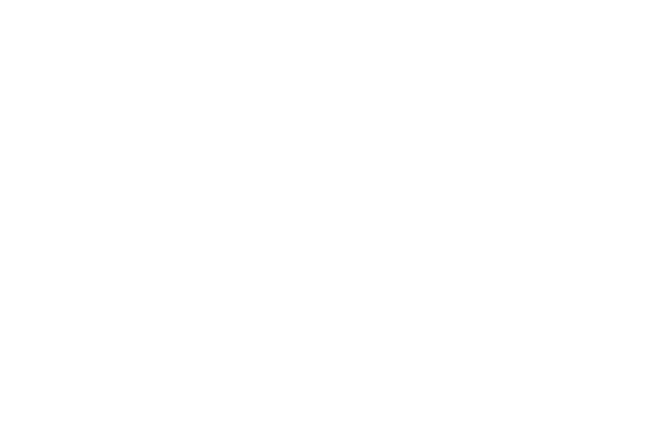

# Tentang Muryp

Muryp adalah organisasi yang berorientasi berdasarkan komunitas dan berdedikasi untuk menciptakan solusi yang berguna bagi masalah Anda melalui pengembangan aplikasi dan kode. Nama Muryp, diambil dari kata "Make Useful Resolutions Your Problem" yang berarti, kami menekankan komitmen dalam menyelesaikan tantangan secara konsisten dan menyediakan solusi yang efektif.

## Misi Kami
Misi kami adalah mengembangkan aplikasi web dan berbagai alat pengembangan lainnya yang sesuai dengan kebutuhan individu maupun bisnis. Selain itu kami juga memiliki tujuan untuk mengumpulkan penggemar pemrograman yang sejalan dengan visi, berbagi pengetahuan, dan saling membantu di dalam komunitas pemrograman.

## Open Source
Kami sangat percaya pada kekuatan kolaborasi dan pengembangan open source. Semua proyek kami bersifat open source, artinya mereka dapat digunakan, dimodifikasi, dan di kontribusikan secara bebas oleh siapa pun. Dengan menganut prinsip open source, kami mendorong pendekatan berbasis komunitas, memungkinkan para pengembang bekerja sama, saling belajar, dan menciptakan solusi inovatif bersama-sama.

## Nilai-nilai Kami
1. Inovasi: Kami bersemangat dalam inovasi dan terus mencari cara baru dan kreatif untuk memecahkan masalah. Kami menganut teknologi terkini dan tetap update dengan tren terbaru dalam pengembangan web dan perangkat lunak.

2. Kolaborasi: Kami menghargai kolaborasi dan percaya pada kekuatan kerjasama. Kami mendorong lingkungan yang mendukung dan inklusif di mana individu dapat berkumpul, berbagi ide, dan berkolaborasi dalam proyek-proyek, menciptakan rasa memiliki dan pertumbuhan bersama.

3. Berbagi Pengetahuan: Kami bersemangat untuk berbagi pengetahuan dan mendorong pembelajaran di dalam komunitas kami. Melalui catatan atau blog dan forum online, kami berupaya untuk memfasilitasi pertukaran ide dan keahlian, memberdayakan individu untuk mengembangkan keterampilan mereka dan berkontribusi pada komunitas pemrograman yang lebih besar.

4. Solusi Ramah Pengguna: Kami berkomitmen untuk menciptakan solusi yang ramah pengguna dan memberikan dampak positif. Kami memprioritaskan pengalaman pengguna dan berusaha mengembangkan aplikasi yang intuitif dan mudah diakses yang dapat secara efektif mengatasi masalah dunia nyata.

## Logo Kami

> show difference logo style in [../img/logo](../img/logo)
Logo Muryp terdiri dari huruf "M" yang berada di tengah dengan pola garis tiga yang unik. Di sebelah kiri dan kanan huruf "M", terdapat dua anak panah yang menghadap ke samping. Anak panah di sebelah kiri mengarah ke kiri, sedangkan anak panah di sebelah kanan mengarah ke kanan. Anak panah ini melambangkan pergerakan, kemajuan, dan arah yang positif.

Anak panah di sebelah kanan, yang mengarah ke kanan, membentuk hubungan dengan huruf "M" dan menciptakan bentuk yang menyerupai huruf "P" di sisi kanan logo. Ini memberikan dimensi tambahan pada logo dan mencerminkan komitmen Muryp terhadap pengembangan perangkat lunak dan solusi yang efektif.

Kombinasi huruf "M" yang diapit oleh anak panah dan bentuk yang menyerupai huruf "P" menciptakan kesan visual yang kohesif dan intuitif. Ini menggambarkan fokus Muryp pada pengembangan kode yang efisien dan solusi yang ramah pengguna dalam mengatasi masalah.

Dengan adanya anak panah yang menghadap ke samping, logo ini juga mewakili tag kode dan menggambarkan komitmen Muryp terhadap dunia pemrograman dan komunitas pengembang.

Dalam keseluruhan, logo Muryp mencerminkan semangat inovasi, pergerakan maju, hubungan antara huruf "M" dan "P", serta komitmen Muryp untuk memberikan solusi yang efektif dan ramah pengguna dalam pengembangan perangkat lunak.

## Bergabunglah Bersama Kami
Jika Anda memiliki semangat dalam pemrograman, pemecahan masalah, dan ingin membuat perbedaan, kami mengundang Anda untuk bergabung dengan komunitas kami. Baik Anda pemula atau berpengalaman, Organisasi Muryp menyediakan platform yang mendukung untuk mengembangkan keterampilan Anda, berkolaborasi dengan individu sevisi, dan berkontribusi pada proyek-proyek yang menarik.

Terhubunglah dengan kami melalui website kami untuk mempelajari lebih lanjut tentang proyek-proyek yang sedang berjalan, mengeksplorasi kontribusi open source, dan menjadi bagian dari komunitas pemrograman yang bersemangat. Bersama, mari menciptakan solusi bermakna dan membentuk masa depan teknologi.

## Hubungi Kami
Jika Anda memiliki pertanyaan atau ingin terlibat dalam Organisasi Muryp, jangan ragu untuk menghubungi kami melalui website kami atau melalui email di **murypdev@gmail.com** Kami dengan senang hati menunggu kabar dari Anda dan bekerja sama untuk membuat perbedaan melalui pemrograman!
