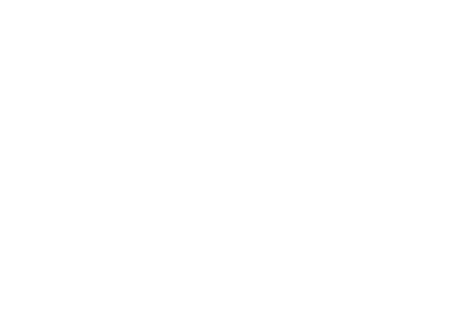

# About Muryp

Muryp is a community-oriented organization dedicated to creating useful solutions for your problems through application development and coding. The name Muryp stands for "Make Useful Resolutions Your Problem," emphasizing our commitment to consistently resolving challenges and providing effective solutions.

## Our Mission
Our mission is to develop web applications and various other development tools that cater to the needs of individuals and businesses alike. Additionally, we aim to gather coding enthusiasts who share our vision, promote knowledge sharing, and provide mutual assistance within the programming community.

## Open Source
We strongly believe in the power of collaboration and open-source development. All our projects are open source, meaning they can be freely used, modified, and contributed to by anyone. By embracing open source principles, we encourage a community-based approach, enabling developers to work together, learn from one another, and create innovative solutions collectively.

## Our Values
1. Innovation: We are passionate about innovation and continuously seek new and creative ways to solve problems. We embrace cutting-edge technologies and stay updated with the latest trends in web development and software.

2. Collaboration: We value collaboration and believe in the power of teamwork. We foster an environment that supports inclusivity, where individuals can come together, share ideas, and collaborate on projects, fostering a sense of ownership and collective growth.

3. Knowledge Sharing: We are enthusiastic about sharing knowledge and promoting learning within our community. Through notes or blogs and online forums, we strive to facilitate the exchange of ideas and expertise, empowering individuals to develop their skills and contribute to the larger programming community.

4. User-Friendly Solutions: We are committed to creating user-friendly solutions that make a positive impact. We prioritize user experience and strive to develop intuitive and accessible applications that effectively address real-world problems.

## Our Logo

> show difference logo style in [../img/logo](../img/logo)
The Muryp logo consists of the letter "M" positioned in the center with a unique three-line pattern. On the left and right sides of the "M," there are two arrows facing sideways. The arrow on the left points to the left, while the arrow on the right points to the right. These arrows symbolize movement, progress, and positive direction.

The right-facing arrow forms a connection with the "M" and creates a shape resembling the letter "P" on the right side of the logo. This adds an additional dimension to the logo, reflecting Muryp's commitment to software development and effective solutions.

The combination of the "M" enclosed by the arrows and the shape resembling the letter "P" creates a cohesive and intuitive visual impression. It represents Muryp's focus on efficient code development and user-friendly solutions in addressing problems.

With the sideways-facing arrows, the logo also represents code tagging and signifies Muryp's dedication to the world of programming and the developer community.

Overall, the Muryp logo reflects the spirit of innovation, forward movement, the connection between "M" and "P," and Muryp's commitment to delivering effective and user-friendly software development.

## Join Us
If you have a passion for programming, problem-solving, and making a difference, we invite you to join our community. Whether you are a beginner or an experienced developer, Muryp Organization provides a supportive platform to enhance your skills, collaborate with like-minded individuals, and contribute to exciting projects.

Connect with us through our website to learn more about ongoing projects, explore open-source contributions, and become part of an enthusiastic programming community. Together, let's create meaningful solutions and shape the future of technology.

## Contact Us
If you have any questions or would like to get involved with the Muryp Organization, feel free to reach out to us via our website or email us at **murypdev@gmail.com**. We look forward to hearing from you and working together to make a difference through programming!
